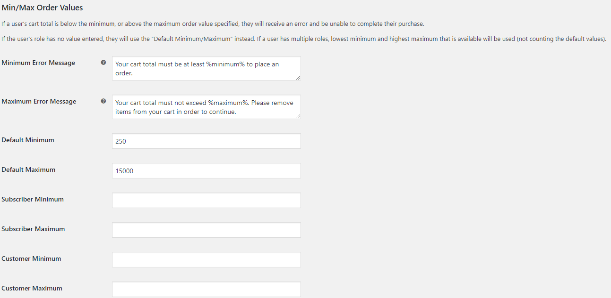
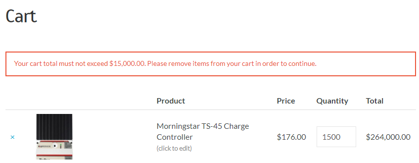

RS Min/max Order Value by Role (WordPress Plugin)
==

_Adds an option to set minimum and maximum order values for individual roles. Options are displayed under WooCommerce Settings > Products > General._

    Contributors: radgh
    Donate link: https://paypal.me/radgh
    Tags: woocommerce, checkout
    Requires at least: 3.2
    Tested up to: 5.0.3
    Stable tag: 1.0.0
    License: GPLv3
    License URI: http://www.gnu.org/licenses/gpl-3.0.txt

## Description ##

This plugin adds the ability to set minimum or maximum price requirement to place an order, based on role. The error message is also configurable.

## Installation ##

1. Upload the plugin files to `/wp-content/plugins/rs-min-max-order-value-by-role/`, or install the plugin through the WordPress plugins screen.
1. Activate the plugin through the 'Plugins' screen in WordPress
1. Change the settings under WooCommerce Settings > Products > General
1. Attempt to place an order with a value outside of the allowed range, and see an error. Trying to checkout, you'll go back to the cart and presented with the error.

## Frequently Asked Questions ##

None yet.

## Screenshots ##

## Changelog ##

#### 1.0
* First release

## Upgrade Notice ##

None yet.